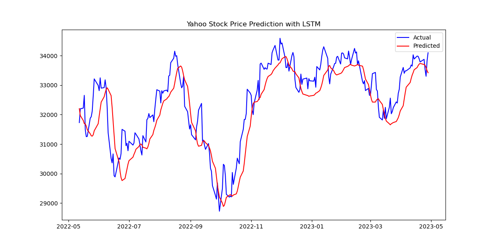
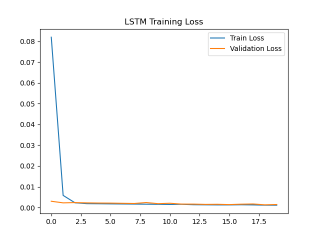

# 📈 Yahoo-Finance-Stock-Market-Prediction  
**Time Series Analysis using LSTM**  

  

---

## 📖 Overview  
This project predicts **stock market prices** using **Long Short-Term Memory (LSTM)** networks.  
It utilizes **Yahoo Finance** stock market data, preprocesses it, and trains an LSTM model to predict future stock prices.  

### 🔹 Key Features:  
✔️ **Data Preprocessing** – Cleans & normalizes stock prices  
✔️ **LSTM Model** – Predicts stock prices based on historical data  
✔️ **Visualization** – Plots training loss & actual vs predicted prices  
✔️ **W&B Integration** – Logs training metrics & visualizations  

---

## 📂 Project Structure  
```
📂 yahoo_stock_lstm/
│── 📄 dataload.py       # Loads & preprocesses the dataset
│── 📄 model.py          # Defines the LSTM model
│── 📄 train.py          # Trains the LSTM model
│── 📄 inference.py      # Runs inference (predictions)
│── 📄 README.md         # Project documentation
│── 📄 requirements.txt  # Dependencies (optional)
│── 📄 training_loss.png # Training loss graph
│── 📄 lstm_prediction.png # Prediction results
```

---

## 🛠️ Setup & Installation  

1️⃣ **Clone the repository**  
```bash
git clone https://github.com/your-username/Yahoo-Finance-Stock-Market-Prediction.git
cd Yahoo-Finance-Stock-Market-Prediction
```

2️⃣ **Install dependencies**  
```bash
pip install -r requirements.txt
```

3️⃣ **Set up Weights & Biases (W&B)**  
Login to W&B with your API key:  
```bash
wandb login YOUR_WANDB_API_KEY
```

---

## 🧩 Usage  

### **1️⃣ Train the LSTM Model**
```bash
python train.py
```
✅ This will:  
✔️ Load the dataset  
✔️ Train the LSTM model  
✔️ Save the trained model as `lstm_model.h5`  
✔️ Log metrics to **W&B Training Dashboard**  

🔗 **My Training Logs:** [View Here](https://wandb.ai/roshenoy30-manipal-institute-of-computer-education/yahoo-stock-lstm/runs/bp2v0dba?nw=nwuserroshenoy30)  

---

### **2️⃣ Run Inference & Predict Stock Prices**
```bash
python inference.py
```
✅ This will:  
✔️ Load the trained model  
✔️ Make predictions on the test set  
✔️ Plot actual vs predicted stock prices  

🔗 **My Inference Logs:** [View Here](https://wandb.ai/roshenoy30-manipal-institute-of-computer-education/yahoo-stock-lstm/runs/8nxuw0b0?nw=nwuserroshenoy30)  

---

## 📊 Results  

### **📌 Training Loss Plot:**  
  

### **📌 Predicted vs Actual Stock Prices:**  
  

🔗 **Full W&B Project Dashboard:**  
👉 [View All Logs & Visualizations](https://wandb.ai/roshenoy30-manipal-institute-of-computer-education/yahoo-stock-lstm?nw=nwuserroshenoy30)  

---

## 🛠️ Technologies Used  
- **Python** 🐍  
- **TensorFlow/Keras** 🔥  
- **Scikit-Learn** 📊  
- **Matplotlib & Seaborn** 📉  
- **Weights & Biases (W&B)** 🚀  

---

## 📌 Future Improvements  
✅ Implement **W&B Sweeps** for hyperparameter tuning  
✅ Compare **GRU-based models**  
✅ Enhance **feature engineering** with technical indicators  

---

## 📜 License  
This project is **open-source** and available under the **MIT License**.  

---

## 📬 Contact  
👤 **Rohan Shenoy**  
📧 Email: roshenoy30@gmail.com  
🔗 GitHub: [rohanshenoy30](https://github.com/rohanshenoy30)  

---


